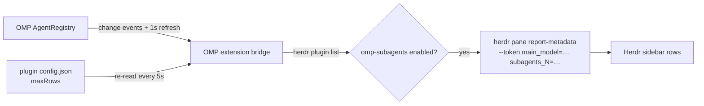

# herdr-omp-subagents

[](https://github.com/hanbong5938/herdr-omp-subagents/releases)


A [Herdr](https://herdr.dev) plugin that shows which model an
[OMP](https://github.com/can1357/oh-my-pi) session is using, and which model each
of its running subagents is using, under the OMP pane in Herdr's agents sidebar.

```
◐ omp · 1 · omp › π ⠋ Fix login flow
  omp (opus-5-5)
  scout:sonnet-5
  task#1:opus-5-5
  task#2:opus-5-5
  +2
```

The main agent's model sits next to the agent name whenever the session is
attached, idle or busy, and follows `/model`. Subagent rows appear when a
subagent starts, follow `/model` switches while it runs, and disappear when it
finishes. With no subagents running only the main model is shown.

## Quick start

> [!NOTE]
> Requires Herdr 0.8+ and OMP 18.1.20+ on macOS or Linux. Tested on Herdr 0.9.1
> with OMP 18.1.20 and 18.4.1.

**1. Install the plugin**

```sh
herdr plugin install hanbong5938/herdr-omp-subagents
```

**2. Install the OMP bridge**

The plugin ships an OMP extension that reads OMP's live agent registry. The
`install-bridge` action links it into `~/.omp/agent/extensions/`:

```sh
herdr plugin action invoke install-bridge --plugin omp-subagents
```

With a named OMP profile, or a non-default agent directory, run the script
directly and pass the directory:

```sh
sh "$(herdr plugin list --json | jq -r '.result.plugins[] | select(.plugin_id=="omp-subagents") | .plugin_root')/scripts/plugin.sh" \
  install ~/.omp/profiles/<profile>/agent
```

**3. Add the sidebar tokens**

Custom metadata tokens only render where your sidebar layout asks for them. The
plugin publishes `$main_model` and up to thirteen child slots, `$subagents_1`
through `$subagents_13`. Add them to `[ui.sidebar.agents]` in
`~/.config/herdr/config.toml`, keeping your existing rows. A complete layout:

```toml
[ui.sidebar.agents]
rows = [
  ["state_icon", "workspace", "tab"],
  ["agent", "$main_model", "$ctx"],
  ["$subagents_1"],
  ["$subagents_2"],
  ["$subagents_3"],
  ["$subagents_4"],
  ["$subagents_5"],
  ["$subagents_6"],
  ["$subagents_7"],
  ["$subagents_8"],
  ["$subagents_9"],
  ["$subagents_10"],
  ["$subagents_11"],
  ["$subagents_12"],
  ["$subagents_13"],
  ["$cache"],
]
```

`$ctx` and `$cache` stand for custom tokens other plugins publish. Keep the ones
your layout already has and drop the ones it does not. A row whose tokens are
not reported disappears, so the unused child slots take no space.

Herdr draws at most 16 rows per agent. The three chrome rows above (state,
agent, cache) leave 13 for child slots. Every additional custom row costs one
child slot: list fewer `$subagents_N` rows, always starting from `$subagents_1`,
and keep `maxRows` (step 4) no higher than the number of slots you list, or the
highest rows, including the `+N` row, are published into slots Herdr never
draws.

Then reload:

```sh
herdr server reload-config
```

**4. Choose how many child rows to show (optional)**

The number of child rows is a plugin setting, `maxRows`, an integer from `0` to
`13`. Without a settings file it is `4`. Find the settings directory with:

```sh
herdr plugin config-dir omp-subagents
```

and create `config.json` in it, for example
`~/.config/herdr/plugins/config/omp-subagents/config.json`:

```json
{ "maxRows": 8 }
```

The two settings live in different places and neither edits the other: `rows`
is Herdr's sidebar layout in the `config.toml` Herdr reads, and decides which
tokens are drawn; `maxRows` is read by the bridge inside each OMP process, from
the path Herdr reports for this plugin, and decides how many child rows are
published. Every running bridge re-reads `config.json` every 5 s, so a change
applies without reloading anything. See [Row limit](#row-limit) for invalid
values.

**5. Restart OMP**

OMP loads extensions at startup, and the bridge is a new extension module.
After each running OMP session finishes its current task, quit it and reopen it
with `omp --resume <session-id>`; `/reload-plugins` does not pick up a newly
linked extension.

## What the rows say

`$main_model` is the main agent's model in parentheses, for example
`(opus-5-5)`. Each child row is `role:model`:

| Part | Source |
| --- | --- |
| `(model)` | The root session's current model, reported while the session is attached, idle included. Before the root attaches the token is cleared; an attached root with no known model shows `(?)`. |
| `role` | The subagent's agent type (`task`, `scout`, `sonic`, …). Several of the same type get `#1`, `#2`, … |
| `model` | The model the subagent is running right now. Known families are shortened: `claude-opus-5-5` → `opus-5-5`, `gemini-3-flash` → `flash-3`. Other ids are shown as-is. An unknown model shows as `?`. |
| `+N` | More subagents are running than `maxRows` allows: the last allowed row counts the ones not shown. |

Child rows list only running subagents of the session in that pane, nested ones
included. Advisors and finished or parked subagents are not listed. A subagent
session never publishes over its parent.

### Row limit

`maxRows` counts the `+N` row. With 12 subagents running:

| `maxRows` | Child rows |
| --- | --- |
| `4` (default) | 3 subagents, then `+9` |
| `8` | 7 subagents, then `+5` |
| `13` | all 12 subagents |
| `1` | `+12` (a single subagent would be shown by name) |
| `0` | none; `$main_model` is still shown |

- A missing `config.json` means `4`.
- Invalid JSON, a value that is not an integer from `0` to `13`, or an
  unreadable file keeps the last valid value (`4` if none was read yet) and
  shows the problem as `last settings error` in `/herdr-subagents`. Fixing the
  file takes effect on the next 5 s read.
- If `herdr plugin config-dir` fails, the bridge keeps the current value and
  asks again on the next read.

## Styling

Tokens accept Herdr's inline token styles. For example, to make the models
stand out from the dim metadata around them:

```toml
[ui.sidebar.agents]
rows = [
  ["state_icon", "workspace", "tab"],
  ["agent", { token = "$main_model", fg = "#98c379" }, "$ctx"],
  [{ token = "$subagents_1", fg = "#56b6c2", bold = true, dim = false }],
  [{ token = "$subagents_2", fg = "#56b6c2", bold = true, dim = false }],
  [{ token = "$subagents_3", fg = "#56b6c2", bold = true, dim = false }],
  [{ token = "$subagents_4", fg = "#56b6c2", bold = true, dim = false }],
  [{ token = "$subagents_5", fg = "#56b6c2", bold = true, dim = false }],
  [{ token = "$subagents_6", fg = "#56b6c2", bold = true, dim = false }],
  [{ token = "$subagents_7", fg = "#56b6c2", bold = true, dim = false }],
  [{ token = "$subagents_8", fg = "#56b6c2", bold = true, dim = false }],
  [{ token = "$subagents_9", fg = "#56b6c2", bold = true, dim = false }],
  [{ token = "$subagents_10", fg = "#56b6c2", bold = true, dim = false }],
  [{ token = "$subagents_11", fg = "#56b6c2", bold = true, dim = false }],
  [{ token = "$subagents_12", fg = "#56b6c2", bold = true, dim = false }],
  [{ token = "$subagents_13", fg = "#56b6c2", bold = true, dim = false }],
  ["$cache"],
]
```

`fg` takes `#RGB` or `#RRGGBB`; named colors are rejected. Rules work too, for
example `rules = [{ contains = "sonnet", fg = "#e5c07b" }]` to color Sonnet rows.
See Herdr's [configuration docs](https://herdr.dev/docs/configuration/) for the
full syntax.

## How it works



- The bridge runs inside OMP only when `HERDR_PANE_ID` and `HERDR_SOCKET_PATH`
  are set, which Herdr does for every pane.
- Every update writes `main_model` and all thirteen `subagents_N` tokens in one
  `report-metadata` call and clears the unused ones, so rows never show a mix
  of two states, and lowering `maxRows` removes the rows above the new limit.
- Tokens carry a 15 s TTL, refreshed every 5 s. If OMP dies without cleaning
  up, the rows expire on their own.
- Every 5 s heartbeat checks `herdr plugin list` and re-reads `config.json`.
  Disabling the plugin in Herdr clears `$main_model` and every child row;
  enabling it restores them, and a new `maxRows` reformats the rows, with no
  OMP restart. A failed settings read never blocks the activation check.

## Commands and actions

| Where | Command | Does |
| --- | --- | --- |
| Herdr | `herdr plugin action invoke install-bridge --plugin omp-subagents` | Link the OMP extension. Replaces a broken link left by an update or a moved checkout; refuses to overwrite any other file. Prints the sidebar and settings setup; edits no config. |
| Herdr | `herdr plugin action invoke doctor --plugin omp-subagents` | Check the Herdr metadata flags, the bridge link and its target, that the plugin is enabled, and report the resolved `config.json` path and whether it exists. Makes no model requests and publishes no metadata. |
| OMP | `/herdr-subagents` | Show the pane binding, bridge state, effective `maxRows` and its config path, the published main token and rows, the last settings error, the main model and every running subagent with its full `provider/model` id. |

## Troubleshooting

**No rows appear.** Run `doctor`, then `/herdr-subagents` inside OMP.

- `pane: unbound`: OMP was not started from a Herdr pane.
- `unsupported: … AgentRegistry API`: this OMP build does not expose the agent
  registry the bridge reads.
- `idle: plugin disabled in Herdr`: run `herdr plugin enable omp-subagents`.
- `/herdr-subagents` is not a known command: OMP has not loaded the extension.
  Check the link with `doctor` and restart OMP.
- The state is `publishing` but the sidebar is empty: `$main_model` or the
  `$subagents_N` rows are missing from `[ui.sidebar.agents] rows`, or the config
  was not reloaded.
- Fewer child rows than expected, or no `+N` row: compare `max rows` in
  `/herdr-subagents` with the number of `$subagents_N` rows in your layout, and
  check `last settings error`.
- `/herdr-subagents` shows no `max rows` line: that session is still running
  the bridge it loaded before an upgrade. Restart it as below.

**Upgrading.** Add `$main_model` to the agent row and the `$subagents_5`
through `$subagents_13` rows your row budget allows, then reload the config.
0.1.x published a single `$subagents` token; replace that row with the
`$subagents_N` rows. After a plugin update, run `install-bridge` again; it
repairs a link the update left broken. OMP sessions that are already running
keep the bridge code they loaded, so restart each one to load the new code:
after its current task finishes, quit it and run `omp --resume <session-id>`.

## Uninstall

```sh
sh <plugin root>/scripts/plugin.sh uninstall   # removes the OMP extension link
herdr plugin uninstall omp-subagents
```

Restart running OMP sessions to unload the extension. Remove `$main_model` and
the `$subagents_N` rows from your sidebar config afterwards, and delete the
`config.json` you created, if any (find its directory with
`herdr plugin config-dir omp-subagents` before uninstalling the plugin); Herdr
does not touch your config.

## Development

```sh
git clone https://github.com/hanbong5938/herdr-omp-subagents
herdr plugin link ./herdr-omp-subagents
herdr plugin action invoke install-bridge --plugin omp-subagents
bun test
```

`herdr plugin link` uses the checkout in place, so edits take effect on the
next OMP restart.
