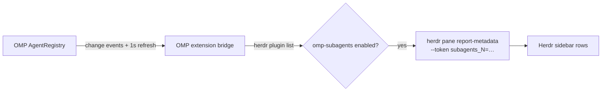

# herdr-omp-subagents

[](https://github.com/hanbong5938/herdr-omp-subagents/releases)


A [Herdr](https://herdr.dev) plugin that shows which model each running
[OMP](https://github.com/can1357/oh-my-pi) subagent is using, one row per agent,
under the OMP pane in Herdr's agents sidebar.

```
◐ omp · 1 · omp › π ⠋ Fix login flow
  omp
  scout:sonnet-5
  task#1:opus-5-5
  task#2:opus-5-5
  +2
```

Rows appear when a subagent starts, follow `/model` switches while it runs, and
disappear when it finishes. When nothing is running the rows are gone, so an
idle pane looks exactly as it did before.

## Quick start

> [!NOTE]
> Requires Herdr 0.8+ and OMP 18.1.20+ on macOS or Linux. Tested on Herdr 0.9.1
> with OMP 18.1.20 and 18.4.1.

**1. Install the plugin**

```sh
herdr plugin install hanbong5938/herdr-omp-subagents
```

**2. Install the OMP bridge**

The plugin ships an OMP extension that reads OMP's live agent registry. The
`install-bridge` action links it into `~/.omp/agent/extensions/`:

```sh
herdr plugin action invoke install-bridge --plugin omp-subagents
```

With a named OMP profile, or a non-default agent directory, run the script
directly and pass the directory:

```sh
sh "$(herdr plugin list --json | jq -r '.result.plugins[] | select(.plugin_id=="omp-subagents") | .plugin_root')/scripts/plugin.sh" \
  install ~/.omp/profiles/<profile>/agent
```

**3. Add the sidebar rows**

Custom metadata tokens only render where your sidebar layout asks for them.
Add the four row tokens to `[ui.sidebar.agents]` in `~/.config/herdr/config.toml`,
keeping your existing rows:

```toml
[ui.sidebar.agents]
rows = [
  ["state_icon", "workspace", "tab"],
  ["agent"],
  ["$subagents_1"],
  ["$subagents_2"],
  ["$subagents_3"],
  ["$subagents_4"],
]
```

Then reload:

```sh
herdr server reload-config
```

**4. Restart OMP**

OMP loads extensions at startup. Quit each running OMP session and reopen it
with `omp --resume <session-id>`; `/reload-plugins` does not pick up a newly
linked extension.

## What the rows say

Each row is `role:model`:

| Part | Source |
| --- | --- |
| `role` | The subagent's agent type (`task`, `scout`, `sonic`, …). Several of the same type get `#1`, `#2`, … |
| `model` | The model the subagent is running right now. Known families are shortened: `claude-opus-5-5` → `opus-5-5`, `gemini-3-flash` → `flash-3`. Other ids are shown as-is. An unknown model shows as `?`. |
| `+N` | More than four subagents are running: the fourth row counts the ones not shown. |

Only running subagents of the session in that pane are listed, nested ones
included. The main agent, advisors, and finished or parked subagents are not.
A subagent session never publishes over its parent.

## Styling

Row tokens accept Herdr's inline token styles. For example, to make the rows
stand out from the dim metadata around them:

```toml
[ui.sidebar.agents]
rows = [
  ["state_icon", "workspace", "tab"],
  ["agent"],
  [{ token = "$subagents_1", fg = "#56b6c2", bold = true, dim = false }],
  [{ token = "$subagents_2", fg = "#56b6c2", bold = true, dim = false }],
  [{ token = "$subagents_3", fg = "#56b6c2", bold = true, dim = false }],
  [{ token = "$subagents_4", fg = "#56b6c2", bold = true, dim = false }],
]
```

`fg` takes `#RGB` or `#RRGGBB`; named colors are rejected. Rules work too, for
example `rules = [{ contains = "sonnet", fg = "#e5c07b" }]` to color Sonnet rows.
See Herdr's [configuration docs](https://herdr.dev/docs/configuration/) for the
full syntax.

## How it works



- The bridge runs inside OMP only when `HERDR_PANE_ID` and `HERDR_SOCKET_PATH`
  are set, which Herdr does for every pane.
- Every update writes all four row tokens in one `report-metadata` call and
  clears the unused ones, so rows never show a mix of two states.
- Tokens carry a 15 s TTL, refreshed every 5 s. If OMP dies without cleaning
  up, the rows expire on their own.
- The bridge checks `herdr plugin list` on every heartbeat. Disabling the
  plugin in Herdr clears the rows; enabling it restores them, with no OMP
  restart.

## Commands and actions

| Where | Command | Does |
| --- | --- | --- |
| Herdr | `herdr plugin action invoke install-bridge --plugin omp-subagents` | Link the OMP extension. Replaces a broken link left by an update or a moved checkout; refuses to overwrite any other file. |
| Herdr | `herdr plugin action invoke doctor --plugin omp-subagents` | Check the Herdr metadata flags, the bridge link and its target, and that the plugin is enabled. Makes no model requests. |
| OMP | `/herdr-subagents` | Show the pane binding, bridge state, current rows, and every running subagent with its full `provider/model` id. |

## Troubleshooting

**No rows appear.** Run `doctor`, then `/herdr-subagents` inside OMP.

- `pane: unbound`: OMP was not started from a Herdr pane.
- `unsupported: … AgentRegistry API`: this OMP build does not expose the agent
  registry the bridge reads.
- `idle: plugin disabled in Herdr`: run `herdr plugin enable omp-subagents`.
- `/herdr-subagents` is not a known command: OMP has not loaded the extension.
  Check the link with `doctor` and restart OMP.
- The state is `publishing` but the sidebar is empty: the `$subagents_N` rows
  are missing from `[ui.sidebar.agents] rows`, or the config was not reloaded.

**Upgrading from 0.1.x.** 0.1.x published a single `$subagents` token. Replace
that row with the four `$subagents_N` rows above, reload the config, and restart
OMP.

## Uninstall

```sh
sh <plugin root>/scripts/plugin.sh uninstall   # removes the OMP extension link
herdr plugin uninstall omp-subagents
```

Remove the `$subagents_N` rows from your sidebar config afterwards; Herdr does
not touch your config.

## Development

```sh
git clone https://github.com/hanbong5938/herdr-omp-subagents
herdr plugin link ./herdr-omp-subagents
herdr plugin action invoke install-bridge --plugin omp-subagents
bun test
```

`herdr plugin link` uses the checkout in place, so edits take effect on the
next OMP restart.
